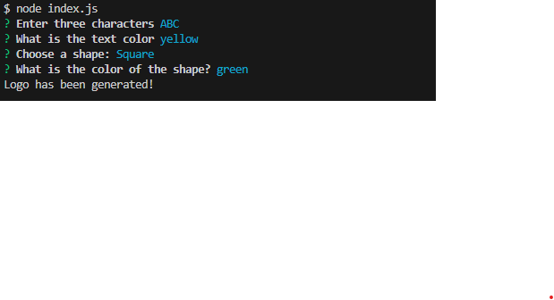

# Logo-Maker

This project is a command-line application designed to help freelance web developers quickly generate simple SVG logos for projects. With a few prompts, users can choose a color and shape, input text, and generate a custom SVG logo file without needing graphic design skills.

### Table of Contents
User Story
Acceptance Criteria
Features
Usage
Video Walkthrough
Installation
Mock-Up

### User Story
As a freelance web developer, I want to generate a simple logo for my projects, so that I don't have to pay a graphic designer.

### Acceptance Criteria
The application meets the following requirements:

Text Prompt: Users can enter up to three characters for the logo.
Text Color Prompt: Users can enter a color keyword or hexadecimal code.
Shape Selection: Users can choose from a list of shapes: circle, triangle, and square.
Shape Color Prompt: Users can enter a color keyword or hexadecimal code for the shape.
SVG Generation: Once all prompts are completed, an SVG file named logo.svg is created, and a success message ("Generated logo.svg") is printed in the command line.
SVG Display: The generated logo.svg file opens in a browser as a 300x200 pixel image that matches the user’s input.

### Features
Customizable Text: Input up to three characters for the logo text.
Flexible Colors: Choose any color for text and shape by entering a color name or hexadecimal color code.
Shape Options: Select from three shapes for the logo: circle, triangle, or square.
SVG File Generation: Quickly save the generated logo as an SVG file.

### Usage
To generate a logo:

Run the application in a command-line interface.
Follow prompts to enter:
Up to 3 characters for the logo text.
A color for the text (color name or hexadecimal).
A shape (circle, triangle, square).
A color for the shape (color name or hexadecimal).
View the generated logo.svg file, which will display a 300x200 pixel logo with your chosen settings.

### Video Walkthrough
To see a demonstration of the application’s functionality, watch the video walkthrough linked below. This video shows the application running, meeting all acceptance criteria, and generating a sample SVG logo.
Link to tutorial: https://drive.google.com/file/d/1ppVNZhhpo58U1lSFuuqEA_iVUTTQH3qK/view?usp=sharing

### Screenshots

